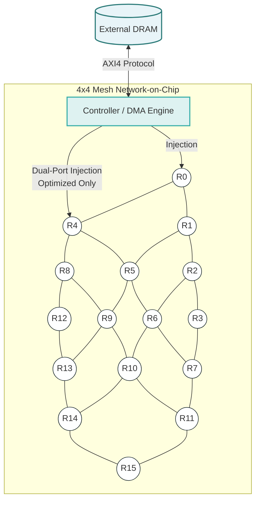

<div align="center">

# SystemC NoC-Based CNN Accelerator

[](LICENSE)
[](https://isocpp.org/)
[](https://accellera.org/)
[](Dockerfile)
[](https://github.com/EtienneIMT/NoC-CNN-Accelerator/actions)

A hardware-accurate, Transaction-Level Model (TLM) simulation of a Network-on-Chip (NoC) Convolutional Neural Network accelerator, demonstrating deep architectural trade-offs such as the "Memory Wall" and Amdahl's Law.

</div>

---

## Table of Contents
- [Overview](#overview)
- [Architecture](#architecture)
- [Key Features](#key-features)
- [Performance & Hardware Metrics](#performance--hardware-metrics)
- [Getting Started](#getting-started)
- [Repository Structure](#repository-structure)
- [Documentation](#documentation)
- [License](#license)

---

## Overview

This project provides a cycle-approximate hardware simulation (built in C++ / SystemC) for a Convolutional Neural Network accelerator. It explicitly replaces simplified software memory assumptions with a realistic, hierarchy-constrained physical topology:

*   **External DRAM** modeling accessed exclusively via an **AXI4 DMA Engine**.
*   **Transaction Level Modeling (TLM)** for SRAM tiling and Double-Buffering.
*   **Wormhole Routing** over a 2D-Mesh Network-on-Chip.

The repository includes both a **Baseline** architecture and a heavily **Optimized** (scaled) hardware topology to mathematically prove the limits of internal silicon scaling when bottlenecked by external I/O (The Memory Wall).

---

## Architecture

The accelerator is built upon a 4×4 Mesh Network-on-Chip (NoC). Each node consists of a Router and a Processing Element (PE), except Node 0, which acts as the Central Controller orchestrating the AXI4 DRAM transactions.



---

## Key Features

- **Realistic Memory Hierarchy:** Enforces an absolute separation between compute units and memory. All weights, biases, and images are fetched strictly via an AXI4 standard memory map.
- **Hardware Abstraction (TLM):** Constraints local SRAM to realistic Edge NPU limits (2.0 MB per PE). Implements Ping-Pong Double-Buffering to mask memory fetch latency while convolutions compute.
- **Dual-NIC Injection:** The `optimized` design scales the NoC flit width to 128-bit and features a sophisticated Producer-Consumer multithreaded Controller that injects data via two independent physical routers (R0 and R4) simultaneously.

---

## Performance & Hardware Metrics

Evaluating the system revealed a textbook demonstration of **Amdahl's Law**. Scaling internal computational power by 4x yielded a negligible speedup (< 1%) because the system became entirely **I/O Bound**.

| Metric / Design Aspect | Baseline Design (`src/baseline/`) | Optimized Design (`src/optimized/`) | Trade-off / Insight |
| :--- | :--- | :--- | :--- |
| **Number of MACs per PE** | 1 | 4 | 4× internal computational scaling |
| **Total MAC Units** | 15 | 60 | Distributed across the mesh |
| **PE Utilization** | 7.18% | 1.80% | Drastic plunge due to data starvation |
| **NoC Data Bus Width** | 32-bit | 128-bit | Widened to transmit 4 floats/cycle |
| **NoC Protocol** | Wormhole (34-bit) | Wormhole (130-bit) | XY Deterministic Routing |
| **AXI4 DRAM Interface** | 32-bit (Single-channel) | 32-bit (Single-channel) | **The Memory Wall bottleneck** |
| **Execution Cycles** | 1.24 × 10¹¹ | 1.23 × 10¹¹ | **~0.7% total system speedup** |

> **Conclusion:** To unleash the computational power of the 60 MAC units, future silicon revisions must widen the external AXI4 bus (to 128-bit or 256-bit) or introduce Multi-Channel Memory Controllers to feed the chip at a higher bandwidth.

---

## Getting Started

The project is fully dockerized to ensure a smooth, reproducible build environment with SystemC 2.3.3.

### 1. Prerequisites
- [Docker Engine](https://docs.docker.com/get-docker/) installed.

### 2. Build the Docker Image
Clone the repository and build the environment (this compiles the SystemC library from source within the container):
```bash
git clone https://github.com/EtienneIMT/NoC-CNN-Accelerator.git
cd NoC-CNN-Accelerator

docker build -t noc-cnn .
```

### 3. Download the Dataset (Required for Simulation)
Since the pre-trained AlexNet weights and test images are large (~550MB), they are provided as a GitHub Release asset.
Download `data.zip` from the [Releases page](https://github.com/EtienneIMT/NoC-CNN-Accelerator/releases) and extract it into the root of the repository:
```bash
# Example if using wget
wget https://github.com/EtienneIMT/NoC-CNN-Accelerator/releases/latest/download/data.zip
unzip data.zip
```

### 4. Run the Simulations
You can execute either the baseline or the optimized architecture. The container will automatically compile the codebase and run the inference simulation on a test image (e.g., `cat` or `dog`).

**Run Baseline:**
```bash
docker run --rm -it noc-cnn bash -c "cd src/baseline && make cat"
```

**Run Optimized:**
```bash
docker run --rm -it noc-cnn bash -c "cd src/optimized && make dog"
```

---

## Repository Structure

```text
.
├── src/
│   ├── baseline/          # Baseline architecture (32-bit NoC, 1 MAC/PE, Single Injector)
│   └── optimized/         # Scaled architecture (128-bit NoC, 4 MACs/PE, Dual-NIC)
├── doc/
│   └── NoC_CNN_Accelerator_Report.pdf # Detailed academic report on architecture and bugs
├── Dockerfile             # Container definition for SystemC 2.3.3
├── .github/workflows/     # CI/CD pipeline ensuring compilation on pushes
└── README.md              # This document
```

---

## Documentation

For a comprehensive deep dive into the hardware modeling decisions, routing flit bit-manipulation, SystemC synchronization delta-cycle bugs, and full performance evaluations, please refer to the extensive final report located in [`doc/NoC_CNN_Accelerator_Report.pdf`](doc/NoC_CNN_Accelerator_Report.pdf).

---

## Attribution & Academic Context

This repository contains my final project and coursework for the **Machine Learning Intelligent Chip Design (2026)** course at the Institute of Electronics, National Yang Ming Chiao Tung University (NYCU).

To uphold academic integrity and clarify code ownership:
- **My Contributions:** I independently designed and implemented the core C++ (SystemC) hardware models across the semester. This includes the NoC Routers (`router.h`), Processing Elements (`pe.cpp`/`pe.h`), AXI4 DMA Engine (`DMA.cpp`), DRAM memory model (`DRAM.cpp`), and the Central Controller (`controller.cpp`), as well as all architectural optimizations (Dual-NIC, 128-bit NoC). All reports and documentation in the `doc/` folder were written by me.
- **Course Staff Contributions:** The course professor (Dr. Kun-Chih Chen) and Teaching Assistants provided the initial project specifications, the standard AlexNet pre-trained weights/biases, test images (`cat.txt`, `dog.txt`), and the baseline `Makefile` framework.

---

## License

This project is licensed under the MIT License - see the [LICENSE](LICENSE) file for details.

<div align="center">
  <i>Developed by Etienne BERTIN for Machine Learning Intelligent Chip Design (2026).</i>
</div>
